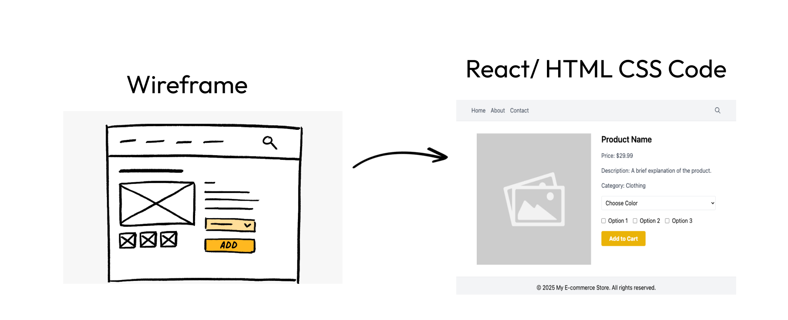

# WireFrameToCode

<div align="center">
  
  <p>Transform wireframes and design mockups into production-ready React + Tailwind code using AI</p>
  <p><strong>⚠️ IMPORTANT NOTE: This project is currently not hosted online due to API credit limitations with OpenRouter. Please follow the setup instructions below to run it locally.</strong></p>
</div>

<div align="center">
  
  
  
  
  
  
  
  ![OpenRouter](https://img.shields.io/badge/OpenRouter-FF4F00?style=for-the-badge&logo=data:image/png;base64,iVBORw0KGgoAAAANSUhEUgAAABgAAAAYCAYAAADgdz34AAAABGdBTUEAALGPC/xhBQAAACBjSFJNAAB6JgAAgIQAAPoAAACA6AAAdTAAAOpgAAA6mAAAF3CculE8AAAABmJLR0QA/wD/AP+gvaeTAAAAB3RJTUUH5gYQFQwRFmZ9CQAABApJREFUSMfdlW1oW2UUx//Pube5N6+3aZKVJmvS1ta6bnWOiUzn3BDc0CFK/TDYBx0TdIPBUBhM/NBvguiX+UFBcFNQEFFBJ8iKk7mJOESnbLZ1dautSZs2bdI0aZrce8/jh5I26eoHP3jwwOFc7vmd53/O/3BI07Qn/6vHuq7j389R6MFay+BpKdgZMMFIXmcUNX39GgghCBoBTJoT05ZtvZ5KpYZu2YAxhsxopmtXsms042daTJtmw1g0BgJCsVBEMVcktm13dHR07L5lAyklA4CgEYA3p2ptD+vLl8rH9699j4Xfi4gYEUTMCBwNvq+naZpu2CTIMAxwzht7JVkCYwxbOtvQ1tVWGrfJBopS//85gy+k4HMMXsTjCBpBTC9Pw7Is+L6Ppp1NJQPbtmGaJgJG4Lpxx09MTMBxHIQjYURbouU+5xx+4MN1XHieh5ZdrWCMwXM9zM/Nw/M8VFVW/TE6OppZl0HZYGEBe3r3IJPJIFQU0L41jubdzTBCBqSUSKfTZRPOeXkfRpIkevr04dLwpQcbMlCEwmfnPwNjDBISiytL6E/1Y3JxEhvtByEEhBDgnJfHuedL/MozcLoxrgYQQRRlYBgGBgcHoes6DNNAoC6Axx55DMmuJBh4RQZCCDDGwDgrjwPgisVdFLOoHXQ4cQiGbtRlIIQA5xyGYcDQjXIgPfOPqckBCFab8U0BmRUTCwsLiMfiiMai9SW67o9xDsdxUCgUYFnWugrWG3ACahziUkpomgZN0+pfw7quN+Y/kpDGZbwwvwDf89G8owWe7+HK1BXs3rsbtm3/K4NarRZ9v/aVawoA9u/fD845lpeWsffuPWhpaYGu6xBClJlsxqBWpADAtu3rll1o7CQmeQnnFy5gdnZWbt261Whra6sIBoOBYrGI/v7+6Gg6/QEFvU+X8vFcer45vDV8qL29vW1ychKxWAyRSASWZeHKzMxypjDzgwTtRDDbGOhODWzt7DyYSCS0qamp8oVcc9WKMWaSZJ9JRV8ahvlhPB7vSaVSRVVVwVUVmq6BMw7P8+A4ztO1RZvNZn/MF00FQOShRx9+KJ/Po6amBlxwSEhIKVnKtE5dVzmgFHYwkUigtroGhBAQAlBCged5xPf9IOcc8/PzuDo9jcHBwdENArxcvudNef7ChWAoFEI2m8VYfhS9e3tRXVONXC4HwzAQj8cxt7CAyspQOXzXdcsJlb3L5bLvlteX9OOpaVTXVAMM+OX3S7i17VZUVVXBsizE4nFYllVq9FJzA/+kDB0dHUQp9c2XX3yVS/YkkdvSQHnhOlzHKbWkEAiHw2WxCSHKpbkeo1Kpr68P9Mw7Zzp3de1+Fl6ZJSEEvr3cjx+GBoI6178hILcI2VhU8ru66qbl/9IID51+99WJhQc6vZMn7wDQBWAG7099MFEsfsIY+wsGXbDL78y9rwAAACV0RVh0ZGF0ZTpjcmVhdGUAMjAyMi0wNi0xN1QwMjoxMjoxNyswMTowMAuNuFMAAAAldEVYdGRhdGU6bW9kaWZ5ADIwMjItMDYtMTdUMDI6MTI6MTcrMDE6MDB60ACPAAAAV3pUWHRSYXcgcHJvZmlsZSB0eXBlIGlwdGMAAHic4/IMCHFWKCjKT8vMSeVSAAMjCy5jCxMjE0uTFAMTIESANMNkAyOzVCDL2NTIxMzEHMQHy4BIoEouAOoXEXTyQjWVAAAAAElFTkSuQmCC)
  ![DrizzleORM](https://img.shields.io/badge/Drizzle_ORM-000000?style=for-the-badge&logo=data:image/png;base64,iVBORw0KGgoAAAANSUhEUgAAABgAAAAYCAYAAADgdz34AAAABGdBTUEAALGPC/xhBQAAACBjSFJNAAB6JgAAgIQAAPoAAACA6AAAdTAAAOpgAAA6mAAAF3CculE8AAAABmJLR0QA/wD/AP+gvaeTAAAAB3RJTUUH5gYQFREFZHIO0wAAAspJREFUSMe11V2IVlUUBuBnxm+cJivSLETSP6yQgkgLog9KKsgoIoIIurgIuugiiqCLLoqgH4qIbgQhkIgioouIoJsgikQhSCyMjErs18nRGUed+abt2o3nHDsj1EV74MPZa7/vu9dee61NKaWh/3N1JJ7EcixAO/7Az/gM729sbf3j3xbvSCmdw6t4DvOKQR2OYBj9mIeluBMrsBGfFPOpKaU/rxMo0j+KXQ7gVDmfwAccx2DRZDGewzuYjVfwerR9bkAJ9incVTRtwVtowxFcLdcOYwibsBSDha+lOI3P4zAjXkzJOYsPUxa+eFzYnsPatGT1nkif0el/a2OxqQ/vhtYNRTsKUCP5e8TJ58WwE70pizOQskjPYhxKa/aN8PKbsb8xGvXvYU5ERImgu4PMj/E8Uuxrsbrwfij8H4m+S/BZJ/7LI3FFBO/ClGI7qxgcbxDxm2J73UdL8X48/o8HwTuDU2+4fSzcXA32XdGkC+cGcVNYHw97Ab5Kt3V/X1rw1aXEXGsCupJ2bU67l9VJ+AbRRssIngkCt1TW5/HnULl+JNosjvPNYUYWrN0N4ofjbjHYS+VebzHojusK7KmQNL3B6ZUi8NtTFmluyoJ/Htf3ojhb6o7WgVo2n8M3GMLKtO3YoiDkZDSYH85v4acY3YIbIshGLCo2v+I4LsXfQMwNYN8NgrsKQQ+F6Srgo3gSjxSxDuBb7MblOMFynJzMZhg7GdaH8CDm3kDsp/BDiH66Cd9aESgi+XK83gptrWDRizfxUgTeHOX3FE7rWbm9cVGpgX3X9uIc9oZI+7AjHo0FuAM3B/nNQe4xzMSjUaRcr2JmRYNJ127T94fwS0LeT2OqnsSW8H82ZRHeKy+tRaRaj0blz7MyBulq+XtK+lxWru0J/6fCd1PKhauVtRtWFZbHMfj15pmTBQvxiDydeor47fiuGF9nnf8FuH0c7yloVXgAAAAldEVYdGRhdGU6Y3JlYXRlADIwMjItMDYtMTZUMjE6MTc6MDUrMDA6MDDuSrN3AAAAJXRFWHRkYXRlOm1vZGlmeQAyMDIyLTA2LTE2VDIxOjE3OjA1KzAwOjAwnxcLywAAAABJRU5ErkJggg==)
  
</div>

## 📋 Table of Contents

- [Features](#-features)
- [Demo](#-demo)
- [Architecture](#-architecture)
- [Getting Started](#-getting-started)
- [Tech Stack](#-tech-stack)
- [API Integration](#-api-integration)
- [FAQ](#-faq)
- [License](#-license)

## ✨ Features

- 🎨 **Upload wireframe images** - Upload your wireframes or design mockups from any source
- 🧠 **AI-powered code generation** - Transform images into React + Tailwind code using advanced AI models
- 💻 **Real-time code preview** - See your generated code in an interactive sandbox environment
- 📋 **Copy to clipboard** - Easily copy the generated code with one click
- 🌐 **Open in CodeSandbox** - Edit and experiment with your code in a full browser environment
- 🎭 **Multiple AI models** - Choose between Google's Gemini, Meta's Llama, Claude, and other advanced models
- 🔄 **Regenerate code** - Not satisfied? Regenerate your code with different instructions
- 🏛️ **Code history** - Access your previously generated code from the dashboard
- 🔑 **User authentication** - Secure user authentication via Firebase
- 💾 **Persistent storage** - Generated code and images stored in database for future access

## 🎬 Demo

> **Note**: Due to API credit limitations with OpenRouter and other services, we currently do not offer a hosted demo. Please follow the setup instructions below to run the application locally.

## 🏗 Architecture

WireFrameToCode uses a modern tech stack:

- **Frontend**: Next.js App Router, React, TypeScript, Tailwind CSS
- **Authentication**: Firebase Authentication
- **Storage**: Cloudinary for image uploads
- **Database**: PostgreSQL (via Neon) with Drizzle ORM
- **AI Integration**: OpenRouter API for access to multiple vision models
- **Code Preview**: CodeSandbox embedded editor

## 🚀 Getting Started

### Prerequisites

- Node.js 18+ and npm/yarn
- Accounts with:
  - Firebase (authentication)
  - Cloudinary (image storage)
  - Neon (PostgreSQL database)
  - OpenRouter (AI model access)

### Environment Setup

1. Clone the repository
   ```bash
   git clone https://github.com/yourusername/wireframetocode.git
   cd wireframetocode
   ```

2. Install dependencies
   ```bash
   npm install
   # or
   yarn install
   ```

3. Copy `.env.local.example` to `.env.local` and fill in the required values:
   ```
   # Firebase (Authentication)
   NEXT_PUBLIC_FIREBASE_API_KEY=your_firebase_api_key
   NEXT_PUBLIC_FIREBASE_AUTH_DOMAIN=your_firebase_auth_domain
   NEXT_PUBLIC_FIREBASE_PROJECT_ID=your_firebase_project_id
   NEXT_PUBLIC_FIREBASE_STORAGE_BUCKET=your_firebase_storage_bucket
   NEXT_PUBLIC_FIREBASE_MESSAGING_SENDER_ID=your_firebase_messaging_sender_id
   NEXT_PUBLIC_FIREBASE_APP_ID=your_firebase_app_id
   
   # Cloudinary (Image Storage)
   CLOUDINARY_CLOUD_NAME=your_cloud_name
   CLOUDINARY_API_KEY=your_api_key
   CLOUDINARY_API_SECRET=your_api_secret
   
   # Database (Neon PostgreSQL)
   DATABASE_URL=your_neon_database_url
   
   # OpenRouter (AI Models)
   OPENROUTER_AI_API_KEY=your_openrouter_api_key
   ```

4. Set up Cloudinary
   - Create a free Cloudinary account at https://cloudinary.com/users/register/free
   - Find your credentials in the dashboard and add them to `.env.local`

5. Set up OpenRouter
   - Get an OpenRouter API key from https://openrouter.ai/keys
   - Add the API key to your `.env.local` file

6. Set up the database
   ```bash
   # Generate the migration files
   npx drizzle-kit generate
   
   # Apply migrations to the database
   npx drizzle-kit push
   ```

7. Start the development server
   ```bash
   npm run dev
   # or
   yarn dev
   ```

8. Open [http://localhost:3000](http://localhost:3000) with your browser to see the application

## 🛠 Tech Stack

### Frontend
- **Next.js**: React framework with App Router architecture
- **TypeScript**: Type-safe JavaScript
- **Tailwind CSS**: Utility-first CSS framework
- **Sandpack**: Code sandbox for previewing generated code
- **Lucide React**: Modern icon set
- **React Icons**: Comprehensive icon library
- **Sonner**: Toast notifications

### Backend
- **Next.js API Routes**: Serverless API functions
- **Drizzle ORM**: Type-safe SQL query builder
- **Neon**: Serverless Postgres database
- **Cloudinary**: Cloud image management

### Authentication and Storage
- **Firebase Auth**: User authentication
- **Cloudinary**: Image storage and manipulation

### AI Integration
- **OpenRouter**: API gateway to multiple AI models
- **Supported Models**:
  - Google Gemini
  - Meta Llama
  - Anthropic Claude
  - DeepSeek
  - and more via OpenRouter

## 🔌 API Integration

### OpenRouter AI Model Integration
WireFrameToCode uses OpenRouter to access various AI vision models that can interpret wireframes and generate code. The application sends the wireframe image along with a text description to the selected AI model, which then generates React and Tailwind CSS code.

### Cloudinary Integration
Images are uploaded to Cloudinary for secure storage and optimized delivery. This ensures wireframe images are securely stored and efficiently served to the AI models.

## ❓ FAQ

### Is there a limit to the image size I can upload?
Cloudinary free tier supports uploads up to 10MB per image. For optimal results, keep your wireframe images under 5MB.

### Which AI model gives the best results?
Different models excel at different types of wireframes. Generally:
- Google Gemini works well for complex layouts
- Meta Llama is good for detailed component designs
- Claude tends to produce cleaner code

### Can I use the generated code commercially?
Yes, the code generated belongs to you and can be used in commercial projects.

### Why isn't the site hosted online?
Due to API credit limitations with OpenRouter and other services, we currently don't offer a hosted demo. The cost of processing many wireframes would exceed reasonable hosting costs.

## 📄 License

This project is licensed under the MIT License - see the LICENSE file for details.

---

<div align="center">
  <p>Made with ❤️ by Saksham Goel</p>
  <p>© 2025-2026 WireFrameToCode</p>
</div>
